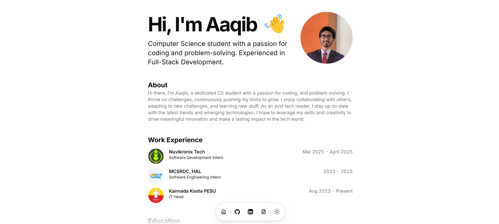
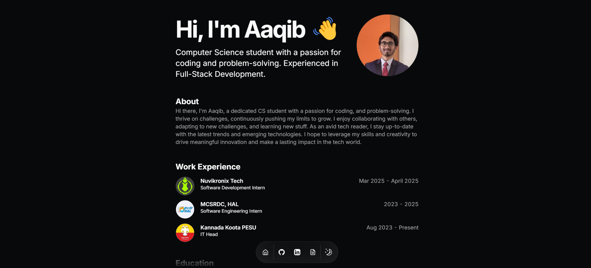

# Aaqib Hakeem

## Full Stack Developer & CS Student

Welcome to my _digital portfolio_ — where code meets creativity. Explore my projects, technical capabilities, and professional growth as I navigate the world of software development.

🌟 **Tech Stack**:  
✔ Frontend: NextJS, ReactJS  
✔ Backend: NodeJS, ExpressJS  
✔ Databases: MongoDB, PostgreSQL  
✔ Languages: Python, C, C++, Java  
✔ DevOps: Docker, Vercel, Render, AWS EC2

🔗 **Portfolio:** [aaqib-portfolio.vercel.app](https://aaqibhakeem.vercel.app/)

---

## 📱 Portfolio Preview

| Light Mode                            | Dark Mode                            |
| ------------------------------------- | ------------------------------------ |
|       |        |

---

## 👨‍💻 About Me

Hi there, I’m Aaqib, a dedicated CS student with a passion for coding, and problem-solving. I thrive on challenges, continuously pushing my limits to grow. I enjoy collaborating with others, adapting to new challenges, and learning new stuff. As an avid tech reader, I stay up-to-date with the latest trends and emerging technologies. I hope to leverage my skills and creativity to drive meaningful innovation and make a lasting impact in the tech world. If you're into coding, anime, or just want to chat tech, let's connect and explore opportunities together!

---

## 📦 Installation & Setup

To run any of my projects locally, follow these generic steps:

### 1️⃣ Clone the Repository

```sh
git clone https://github.com/AaqibHakeem/[project-name].git
cd [project-name]
```

### 2️⃣ Install Dependencies

```sh
npm install
```

### 3️⃣ Run the Development Server

```sh
npm run dev
```

Then, open **[http://localhost:3000](http://localhost:3000/)** in your browser! 🚀

---

## 🔗 Connect with Me

📧 **Email**: [aqibhkeemclg@gmail.com](mailto:aqibhkeemclg@gmail.com)  
📱 **Phone**: +91 8123685938  
📍 **Location**: Electronic City, Bangalore, Karnataka  
💼 **LinkedIn**: [linkedin.com/in/aaqib-hakeem](https://linkedin.com/in/aaqib-hakeem)

---

<div align="center">— thoughtfully developed —</div>